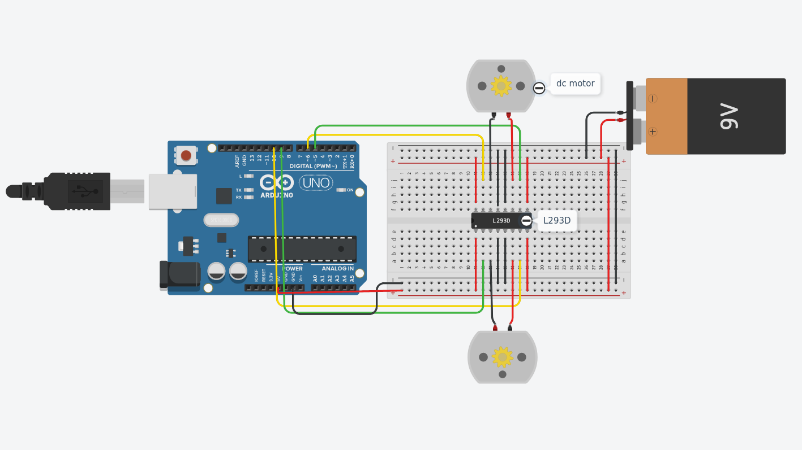

# Control Motor Driver

This circuit was implemented in <a href="https://www.tinkercad.com/things/0TWCC0VV2vM-control-motor-driver-arduino/editel?sharecode=2wJG9QLaSHSWUnEm4111AmiwqUeFnLTGl4dGId418WQ"> TinkerCAD</a>.

### Materials needed are:
-Arduino Uno R3

-H-bridge Motor Driver

-DC Motor

-Breadboard

### About a Motor Control Drive:
A motor drive controls the speed, torque, direction, and resulting horsepower of a motor. Dc drives typically control a shunt-wound dc motor, which has separate armature and field circuits. Ac drives control ac-induction motors and, like their dc counterparts, control speed, torque, and horsepower.

### The setup:
We are using 2 DC Motors for this experiment .We also need a L293D quadruple high-current half-H driver.Connect Vcc1 pin to the 5v outputon the Arduino.
Connect the grounds to the negative of the circuit.Connect all the input pins (IN1,IN2,IN3,IN4) to the Arduino digital pins(5,6,10,9).Also connect one motor to the OUT1 and OUT2 and the other motor to OUT3,OUT4.
### Arduino Code
```sh
//L293D
//Motor A
const int motorPin1  = 5;  // Pin 14 of L293
const int motorPin2  = 6;  // Pin 10 of L293
//Motor B
const int motorPin3  = 10; // Pin  7 of L293
const int motorPin4  = 9;  // Pin  2 of L293

//This will run only one time.
void setup(){
 
    //Set pins as outputs
    pinMode(motorPin1, OUTPUT);
    pinMode(motorPin2, OUTPUT);
    pinMode(motorPin3, OUTPUT);
    pinMode(motorPin4, OUTPUT);
    
}


void loop(){
    analogWrite(motorPin1, 180);
    digitalWrite(motorPin2, LOW);
    analogWrite(motorPin3, 180);
    digitalWrite(motorPin4, LOW);

}
```
### Link to my TinkerCAD implementation:
<a href="https://www.tinkercad.com/things/0TWCC0VV2vM-control-motor-driver-arduino/editel?sharecode=2wJG9QLaSHSWUnEm4111AmiwqUeFnLTGl4dGId418WQ">TinkerCAD</a>.

