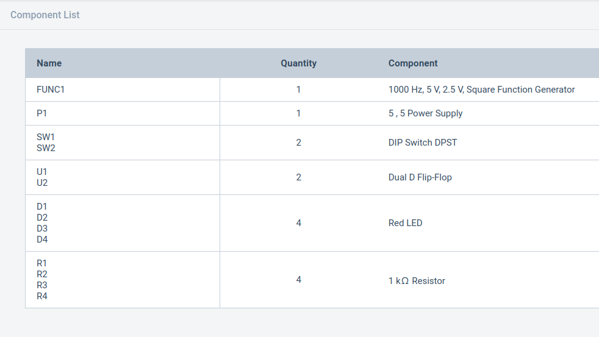

### Shift Registers

### About Shift Register:
A shift register is a type of digital circuit using a cascade of flip-flops where the output of one flip-flop is connected to the input of the next. They share a single clock signal, which causes the data stored in the system to shift from one location to the next.
By connecting the last flip-flop back to the first, the data can cycle within the shifters for extended periods,
and in this form they were used as a form of computer memory.
There are basically four kinds of shift register-

SISO(Serial In Serial Out),

SIPO(Serial In Parallel Out),

PIPO(Parallel in Parallel Out ),

PISO(Parallel in Series Out).
### Serial In Serial Out(SISO)

The SISO shift register is one of the simplest of the four configurations as it has only three connections, the serial input (SI) which determines what enters the left hand flip-flop, the serial output (SO) which is taken from the output of the right hand flip-flop and the sequencing clock signal (Clk).

<a href="https://www.tinkercad.com/things/8yaRpqmOOsN-siso-shift-register/editel?sharecode=WN-gML5JJaRJ0daAXs9COjbNC5Si1LZtDquynghaLKg">TinkerCAD</a>.

### Serial In Parallel Out(SIPO)

In Serial In Parallel Out (SIPO) shift registers, the data is stored into the register serially while it is retrieved from it in parallel-fashion.

<a href="https://www.tinkercad.com/things/7i8ZuN4J1CX-sipo-shift-register/editel?sharecode=lvKs4dsC_rzlaAS2RA3iVzjHh8fnW36RHzlawBnWg9U">TinkerCAD</a>.

### Parallel In  Parallel Out(PIPO)

Parallel In Parallel Out (PIPO) shift registers are the type of storage devices in which both data loading as well as data retrieval processes occur in parallel mode.

<a href="https://www.tinkercad.com/things/7kjGcoKtgVG-pipo-shift-register/editel?sharecode=LsjWZRF2BHl9sI0PL3h_NrK7PX97HKgca772kbSi_6c">TinkerCAD</a>.

### Parallel in Serial Out(PISO)

The shift register, which allows parallel input (data is given separately to each flip flop and in a simultaneous manner) and produces a serial output is known as Parallel-In Serial-Out shift register.

<a href="https://www.tinkercad.com/things/kuZuwS53wcW-piso-shift-register/editel?sharecode=V7J9PvrVIHo50Wl7mhhqhlb_VUqkRB0-otOZUyUk6ho">TinkerCAD</a>.

